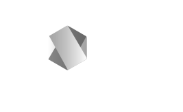

# NodeJS by Coda



*Image illustrant NodeJS.*

## Sommaire :

- [**🌟 Introduction**](#introduction)
  - [Qu'est-ce que NodeJS ?](#quest-ce-que-nodejs-)
  - [Son origine](#son-origine)
  - [Son fonctionnemment](#son-fonctionnemment)
  - [Des alternatives ?](#des-alternatives-)
  - [Un gestionnaire de paquets](#un-gestionnaire-de-paquets)
  - [Comprendre le pakage.json]()
    - [Un package de base]()
    - []()
    - []()
- [**hello-node**]()
- [**node-joke**]()
- [**node-intergirAvecLeSysteme**]()
- [**node-serveurWeb**]()


- [**🏁 Conclusion**](#conclusion)
- [**🥇 Contribution**](#contribution)
  - [Contribueur](#contribueur)
- [**Licence**](#licence)

## **🌟 Introduction**
### Qu'est-ce que NodeJS ?
Node.js est un environnement d'exécution JavaScript côté serveur, basé sur le moteur V8 de Google, qui permet d'exécuter du JavaScript en dehors d'un navigateur. Créé pour développer des applications réseau rapides et scalables, il utilise un modèle d’E/S non bloquant et orienté événements, ce qui le rend idéal pour les applications en temps réel et les systèmes distribués. Avec Node.js, on peut utiliser JavaScript pour créer des applications backend, gérer des serveurs, et accéder aux systèmes de fichiers, rendant le développement JavaScript full-stack possible.
### Son origine
Node.js a été créé en 2009 par Ryan Dahl. À l'époque, Dahl a remarqué que les serveurs web classiques, comme Apache, bloquaient les requêtes pendant qu'ils attendaient des réponses, ce qui ralentissait les performances, surtout pour les applications en temps réel. Il a donc conçu Node.js en utilisant le moteur V8 de Google, optimisé pour exécuter JavaScript très rapidement.

Le choix de JavaScript était audacieux, car jusqu'alors, il était surtout utilisé pour le développement front-end. Node.js a permis d'étendre JavaScript au backend, donnant naissance à l'écosystème JavaScript full-stack que l’on connaît aujourd’hui.
### Son fonctionnemment
Node.js fonctionne grâce à un modèle d'E/S non bloquant et orienté événements. Concrètement, cela signifie qu'il gère les requêtes de manière asynchrone, ce qui permet de traiter plusieurs requêtes en même temps sans attendre qu'une opération soit terminée avant de passer à la suivante. Voici les principaux éléments de son fonctionnement :

1. **Événements et boucle d'événements** : Node.js repose sur une boucle d'événements (event loop) qui écoute et répond aux requêtes. Quand une opération (comme une requête de base de données) est en cours, Node.js continue de traiter d'autres requêtes et revient aux opérations terminées quand elles sont prêtes. 

2. **Callbacks et Promesses** : Pour gérer l'asynchronisme, Node.js utilise des fonctions de rappel (callbacks) ou des promesses (promises) qui permettent de traiter les actions une fois qu'elles sont terminées, sans bloquer le flux de l'application.

3. **Modules** : Node.js utilise des modules (librairies et outils prédéfinis) pour simplifier des tâches courantes, comme la gestion de fichiers, les requêtes HTTP, etc., via son gestionnaire de packages, npm, qui centralise des milliers de modules externes pour étendre les fonctionnalités de Node.js.

Ce fonctionnement rend Node.js très performant pour les applications nécessitant une forte réactivité, comme les applications en temps réel ou les systèmes à grande échelle.
### Des alternatives ?

Une alternative notable à Node.js est **Deno**, créé en 2018 par... Ryan Dahl, le même créateur que Node.js ! Dahl a conçu Deno pour corriger certaines limitations et faiblesses qu'il avait identifiées dans Node.js avec le recul, comme :

1. **Sécurité par défaut** : Deno est conçu pour être plus sécurisé ; il limite l'accès aux fichiers, au réseau et aux permissions système par défaut. Pour exécuter des actions sensibles, les autorisations doivent être explicitement accordées, ce qui réduit les risques de failles de sécurité.

2. **Support natif de TypeScript** : Deno supporte directement TypeScript sans avoir besoin de configurations supplémentaires, contrairement à Node.js, qui nécessite des outils comme Babel ou TypeScript.

3. **Gestion des modules sans npm** : Deno ne dépend pas de `npm` pour les modules. Il utilise des URL pour importer des dépendances, ce qui réduit les problèmes liés à la centralisation des modules et simplifie la gestion des dépendances.

4. **Standardisation des API** : Deno suit les standards du navigateur pour les API (comme `fetch` pour les requêtes HTTP), rendant le code plus compatible avec le front-end et facilitant la transition entre navigateur et serveur.

Bien que Deno soit prometteur et corrige certaines limitations de Node.js, il reste encore moins populaire, avec un écosystème plus limité. Cependant, il offre une alternative moderne pour les développeurs qui recherchent une approche sécurisée, typée et plus proche des standards du web.
### Un gestionnaire de paquets
Le gestionnaire de paquets principal pour Node.js est **npm** (Node Package Manager), qui permet d'installer, de mettre à jour, de gérer et de partager des librairies et des outils JavaScript. En plus de npm, il existe aussi **yarn**, un autre gestionnaire de paquets développé par Facebook, qui offre des fonctionnalités similaires mais avec des optimisations au niveau de la rapidité, de la gestion des dépendances et de la fiabilité.

#### Fonctionnalités principales de npm :

1. **Installation de packages** : npm permet d'installer des modules directement depuis le registre npm, ce qui rend des milliers de packages disponibles pour étendre les fonctionnalités d’une application Node.js.
   
2. **Gestion des versions** : npm simplifie le contrôle des versions des packages utilisés, permettant de fixer une version spécifique pour éviter les conflits et bugs dus aux mises à jour.

3. **Scripts personnalisés** : Avec npm, on peut définir des scripts pour automatiser des tâches (comme le démarrage du serveur, les tests ou le build), ce qui facilite le workflow de développement.

4. **Dépendances locales et globales** : npm permet d'installer des packages pour un projet spécifique ou globalement pour tout le système, selon les besoins.

Avec npm, Node.js dispose d’un écosystème riche, qui favorise la réutilisation et le partage de code, accélérant ainsi le développement de projets JavaScript.
## hello-node
Création du dossier `hello-node` et du fichier `index.js` dans se dossier avec le contenu suivant :
```JS
console.log("Hello world !");
```
puis entrée la commande suivante dans le terminal une fois dans le dossier :
```bash
node index.js
```
se qui doit répondre :
```
hello world !
```
## node-joke
Création du dossier `hello-joke` et initialisation de `NodeJS` dans se dossier avec le contenu suivant :
```bash
node init
```
se qui créer un dossier `node_module` un fichier de configuration du nom de `package.json` avec le contenu par default suivante :
```JS
{
  "name": "joke",
  "version": "1.0.0",
  "main": "index.js",
  "scripts": {
    "test": "echo \"Error: no test specified\" && exit 1"
  },
  "author": "",
  "license": "ISC",
  "description": "",
  "dependencies": {
    "give-me-a-joke": "^0.5.1"
  }
}
```
puis installer `give-me-a-joke` avec la commande :
```bash
npm install give-me-a-joke
```
se qui créer d'autre fichier lier au module que l'on vient d'installer.
nous allons créer un index.js avec le code suivant :
```JS
const giveMeAJoke = require('give-me-a-joke');

    giveMeAJoke.getRandomDadJoke(function(joke)
{
    console.log(joke);
});
```
puis lancer la commande :
```bash
node index.js
```
se qui lancera une blague.
## node-intergirAvecLeSysteme
Interagir avec le système
```JS

```
## node-serveureWeb

## my first api


## **🏁 Conclusion**
## **🥇 Contribution**

Les contributions à ce repository sont les bienvenues ! Si vous souhaitez corriger une erreur ou améliorer le contenu existant, n'hésitez pas à m'en faire part.

### Contribueur

- [**👨‍💻🥇 Alexander worldercraft**](https://github.com/alexanderworldercraft)

## Licence

Ce contenu est sous licence [GNU GPLv3](LICENSE.txt). Vous êtes libre de l'utiliser, le modifier et le distribuer selon les termes de cette licence.

---

Bonne apprentissage et bon développement !